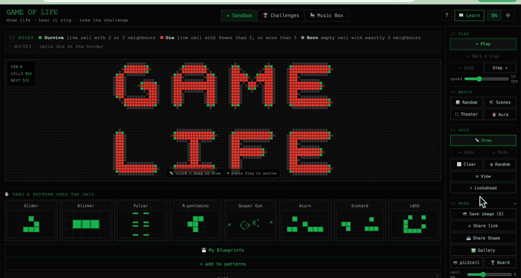
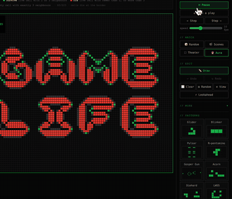
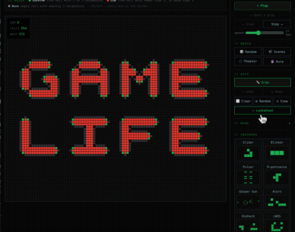
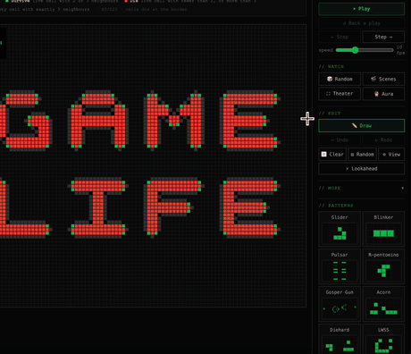
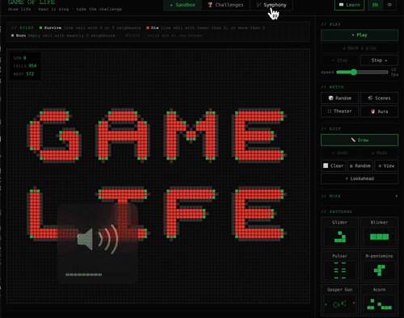

# GAME LIFE — a tiny browser arcade

**[▶ Walk the floor at lifegameproject.com](https://lifegameproject.com)**

What began as a Conway's Game of Life implementation grew into a terminal-themed arcade: a main floor of finished cabinets, a WIP lab of rough experiments, online co-op over Firebase, and an iOS shell. Everything is vanilla HTML/CSS/JS + canvas — one file per game, no frameworks, no build step.



---

## The arcade floor

| Cabinet | What it is |
|---|---|
| **game_of_life.exe** | The original. Draw patterns, watch them evolve, turn them into music — sandbox, 11 leaderboard challenges, and a Music Box sequencer. *(details below)* |
| **glyph_run.exe** | An arena survivor where you ARE a Chinese character — evolve 3,000 years back to your oracle-bone form. Every monster, weapon and drop is a real ancient glyph. *(details below)* |
| **gomoku.exe** | Classic 5-in-a-row. Beat a minimax AI (alpha-beta), watch AI-vs-AI, or play a friend online. |
| **tether.exe** | Two players, one rope. Verlet rope physics, wind, ice, crumbling ledges — local or online co-op. |
| **labyrinth.exe** | An endless torch-lit descent — fog-of-war line-of-sight, A* pathfinding, a bigger maze every escape. |
| **grow_a_tomato.exe** | Grow the biggest, sweetest tomato — powered by a real plant-metabolism model. |
| **tomatoswipe.exe** | Minesweeper, but the mines are tomatoes. |
| **sudoku.exe** | Backtracking generator with a guaranteed unique solution; pencil marks, hints, one-click solver. |

Every game is bilingual (English / 中文, toggle in the header) and touch-friendly.

---

## 字源 Glyph Run — an arena survivor that teaches oracle-bone script

A top-down Brotato-style survivor where **you are a Chinese character**, and every system doubles as a 字源 (etymology) lesson sourced from [zdic.net 字源字形](https://zdic.net):

- **You only steer** (WASD / virtual joystick) — ink auto-attacks, weapons fire themselves, and each of the eight families' gifts is woven into movement: 人→大→夫→舞 slips fated blows, 牛→牢→牧→犇 shoulders enemies aside, 鬼→魂→魅→魔 drifts and phases, 象→像→豫→為 quakes with every stride, 隹→鳥→鳴→鳳 gusts the pack back, 羊→羔→美→羴 scatters it in panic, 木→本→林→森 roots it fast, and 火→炎→焱→燚 burns a cinder trail.
- **Glyph drops are XP — and each does its meaning**: 魚 heals, 貝 pays, 龜 shells you, 雨 slows the field, 鳥 dives the nearest three… level up and your character evolves mid-fight.
- **Equipment is 部首**: every arm is a true radical worn at its compound position — 弓 at your left like 引, 戈 guarding your back like 伐, 罒 crowning you like 羅, 灬 smouldering beneath like 羔 — plus utility radicals: 宀 a roof that blocks, 氵 a splash that mires, 忄 a heart that mends. Starting arms come cast in bronze; duplicates recast toward 甲骨文.
- **合文 composition**: become the right form while carrying the right radical and you spell a real character — 牛+宀=牢, 隹+网=羅, 羊+灬=羔, 林+灬=焚, 人+戈=伐, 木+斤=析, 牛+刀=解, 鬼+忄=愧, 火+宀=灾… the composed radical acts one casting older, and every compound you spell is kept in the codex gallery.
- **The script era rewinds each wave** (隸書 → 篆書 → 金文 → 甲骨文) through the oracle 門 gate; the wave clock counts in real oracle-bone numerals; death is marked by 亡, the broken blade.
- **A bestiary of real characters**: 鬼 spirits, charging 豕, pouncing 虎, the vessel bosses 皿 and 蠱, and a nine-segment 龍 — each named on first sight, each with a slow-motion arrival banner.
- **The UI is a physical object**: menus are aged rice paper struck with a hand-carved 字源 seal, the death screen is a cracked oracle shell, upgrade choices are written on an unrolling bamboo scroll (竹简) and circled in cinnabar brush — all set in a brush-script face, not a keyboard font.
- **Ink is the feedback**: every strike is a tapered brush stroke, fallen spirits splatter lasting ink on the ground, your own wounds run cinnabar, and a synthesized brush-on-paper soundscape (mutable 音/默) gives each hit weight.
- **五行 synergies**: every drop carries an element (weapons and 鼎 are 金); stack pairs that feed each other — 水木相生 regenerates, 金火鍛造 re-tempers a shield, 土水成泥 lengthens every slow, 木火燎原 keeps your ink burning. Hoard one element and its opposite (相剋) starts hunting you.
- **The scholar's desk (文房四宝)**: between waves a bamboo scroll unrolls with three refinements across 筆 brush · 墨 ink · 硯 inkstone · 紙 paper — some pay now, the ones marked 遠 pay at the bones. 墨池 makes kills leave mire-ink pools.
- **合文 ripening**: glyphs left clustered on the ground fuse into a 鼎 worth five glyphs, a heart and the light of 光 — guard territory instead of hoovering XP.
- **篆刻 meta-progression**: waves survived and glyphs gathered earn cuts; carve radicals (心止又目火貝) into a soapstone seal and every later run opens with the seal stamping your bonuses onto the paper.
- **In-game codex** (文): a permanent unlock gallery — foes met, forms grown, tiers held and synergies woken persist between runs; the rest stays veiled as 未識 — with every entry linked back to its zdic 字源字形 page.

---

## The WIP lab (`/wip.html`)

Playable-but-rough experiments: **escape_grid.exe** (4 runners vs 1 hunter, Dijkstra AI), **keep_up.exe** (co-op Pong), **lander.exe** (two-player lunar lander — one throttles, one steers), **train_rl_hunter.exe** (watch an RL policy learn in-browser), and **greenhouse.exe** (the raw plant digital-twin behind grow_a_tomato).

---

## Online co-op

Gomoku, Tether, Keep-Up and Lander support remote play: create a room, share the code, play across devices. Realtime sync is Firebase RTDB — no accounts, no install.

---

## The original cabinet: Conway's Game of Life

Three modes, switched from the header: **✦ Sandbox** (draw, stamp, evolve), **🏆 Challenges** (11 goal-based puzzles with a global Supabase leaderboard and shareable winning seeds), and **🎠 Music Box** (the grid becomes a sweep sequencer — row = pitch on a pentatonic scale, Web Audio, 100% client-side).

| | |
|:--:|:--:|
| **draw & play**<br> | **🔮 Aura** — cells coloured by age<br> |
| **⚡ Lookahead** — preview future generations<br> | **🎠 Music Box** — patterns become music<br> |

Highlights: freehand drawing with zoom/pan, 8 classic patterns with drag-and-drop stamping (rotate/mirror), full undo/redo plus "back a play", image→cells conversion, save/share patterns to a community gallery, PNG export, B3/S23 on a finite grid.

🔊 **[▶ Watch the Music Box with sound](demo/symphony-with-sound.mp4)**

---

## Tech notes

- **Stack**: vanilla JS + canvas, one self-contained HTML file per game in `game/`. No dependencies, no build.
- **Deploy**: GitHub Pages from `main` → lifegameproject.com (HTML cached ~10 min; games carry a small build tag next to their back-link).
- **iOS**: `app/` is a Capacitor shell that bundles a frozen copy of the site (`npm run ios` re-syncs `app/www` before archiving).
- **Services**: Supabase (Life leaderboard/gallery), Firebase RTDB (remote play rooms).

## Run locally

```bash
# no build step — just open it
open index.html
# or serve:
python3 -m http.server 8080
```

---

## Built by

[Houfu Chen](https://houfu72.com) · Sam Qiu · Husam

Contact: houfuchen0702@gmail.com

## License

MIT
