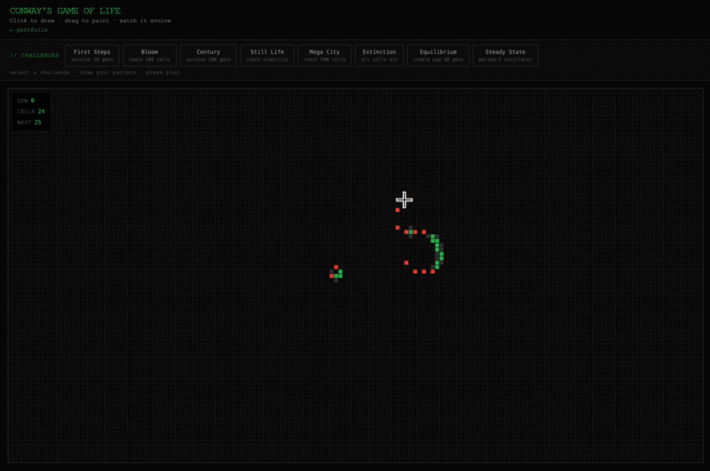

# Conway's Game of Life

An interactive browser implementation of Conway's Game of Life — zero dependencies, pure HTML/CSS/JS.

**[▶ Play it live at lifegameproject.com](https://lifegameproject.com)**


---

## Three modes

Switch from the toggle in the header:

- **✦ Sandbox** — free play: draw, stamp patterns, and watch them evolve
- **🏆 Challenges** — goal-based puzzles with a global leaderboard
- **🎵 Music** — turn the simulation into a sequencer (see below)

---

## Features

### Core
- **Draw freely** — click or drag to paint cells; right/middle-click to pan
- **Zoom & pan** — scroll to zoom into any point; pinch on mobile
- **8 built-in patterns** with shape thumbnails — Glider, Blinker, Pulsar, R-pentomino, Gosper Gun, Acorn, Diehard, LWSS
- **Drag-and-drop stamping** — drag any pattern onto the canvas with a ghost preview; rotate (R / scroll) and mirror (F) before stamping
- **↺ Back a play** — jump the board back to how it was before your last Play; hit again to step back through earlier plays
- **Undo / Redo** — full history for both drawing and simulation steps
- **Speed & cell size** — 1–30 fps, adjustable cell size
- **Finite grid** — cells die at the border (no toroidal wrapping)
- **Responsive** — resizes with the window; mobile touch drawing + pinch-zoom

### Watch & show (Sandbox)
- **Watch** — load a random curated scene and play it
- **Scenes** — a gallery of curated starting patterns
- **Theater** — immersive full-screen viewing, just the pattern
- **Aura** — colour cells by age (green → violet as they survive)
- **Save image** — export the current pattern as a PNG

### 🎵 Music mode
The grid becomes a **sweep sequencer**: a playhead scans the columns left→right, and the live cells under it play notes — **row = pitch** (high at the top, low at the bottom), snapped to a major-pentatonic scale so it always sounds in tune.

- **Pause** loops your pattern as a repeating riff; **press Play** and the tune evolves with the simulation
- **Controls** — sound on/off, tempo (sweep speed), volume, and tone (soft / pure / retro / sharp)
- Draw or stamp shapes to compose by hand — built with the Web Audio API, 100% client-side

### 🏆 Challenges & leaderboard
- **11 challenges** — First Steps, Bloom, Century, Still Life, Mega City, Extinction, Equilibrium, Steady State, Zone Control, Compressed Gas, Bridge
- **Anti-cheat** — drawing locks once the simulation starts; set your initial pattern before pressing Play
- **Global leaderboard** — powered by Supabase; submit your score with a nickname after winning
- **Share your seed** — winners' starting patterns are stored, so anyone can replay from the same start

### Community
- **Share Shape** — encode your grid as a URL-safe link or post it to the community gallery
- **Gallery** — browse and load patterns shared by other players

### Saved patterns
- **My Saves** — save the current grid as a named blueprint, stored locally in your browser
- **Add to Patterns** — turn a saved blueprint into a draggable tile with an auto-generated shape thumbnail

### Image → Cells
- **Upload any image** — converts to live/dead cells based on a brightness threshold
- **Live preview** with adjustable threshold & invert — 100% client-side; the image never leaves your browser

### Language
- **English / 中文** — full bilingual support, toggle in the header

---



---

## Rules (B3/S23)

| State | Condition | Next state |
|---|---|---|
| Live | 2 or 3 live neighbours | Survives |
| Live | < 2 or > 3 live neighbours | Dies |
| Dead | exactly 3 live neighbours | Born |

---

## Run locally

```bash
# Just open the file — no build step, no server needed
open index.html
```

Or serve it:
```bash
python3 -m http.server 8080
# then open http://localhost:8080
```

---

## Built by

[Houfu Chen](https://houfu72.com) · Sam Qiu · Husam

Contact: houfuchen0702@gmail.com

---

## License

MIT
